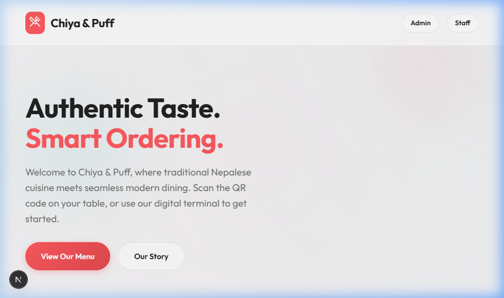

# Chiya and Puff



Chiya and Puff is a restaurant operations app for a Nepalese menu. It combines a public QR ordering flow with separate dashboards for admin, waiter, and kitchen staff. Built with Next.js, Prisma, and PostgreSQL for a seamless experience.

## Features

- Public menu and QR-based table ordering.
- Order tracking for guests, including billed orders and waiter call requests.
- Waiter table management with QR links and service-state updates.
- Kitchen display for preparing and ready orders with chef-only completion controls.
- Admin dashboard for menu, tables, staff, and analytics.
- Distinct table request types for service calls and bill requests.
- Customer bill modal with receipt-style layout and print/share actions.
- Prisma-backed data layer (PostgreSQL for production/Vercel).

## Operational Flow

- Customer places order from table QR page.
- Waiter starts preparation by moving order from pending to preparing.
- Chef marks order delivered when ready.
- Waiter can generate the final bill.
- Customer can request bill any time and preview payable totals.
- After payment confirmation, orders remain visible until staff clears the table.
- Session fully resets only after waiter/admin marks the table available.

## Tech Stack

- Next.js 16 App Router
- React 19
- Prisma ORM
- PostgreSQL (recommended for local + production)
- JWT authentication with jose
- bcryptjs for password hashing

## Prerequisites

- Node.js 20 or newer recommended
- npm

## Local Setup

1. Install dependencies.

```bash
npm install
```

2. Create a local env file if you want to override the defaults.

```bash
cp .env.example .env
```

3. Generate Prisma Client, push schema to your PostgreSQL database, and seed default data.

```bash
npm run db:setup
```

4. Start the development server.

```bash
npm run dev
```

Open http://localhost:3000.

## Scripts

- `npm run dev` starts the development server.
- `npm run build` creates a production build.
- `npm run start` serves the production build.
- `npm run lint` runs ESLint.
- `npm run db:setup` pushes the Prisma schema and seeds the database.
- `npm run setup` installs dependencies, generates Prisma Client, and runs the database setup.

## Default Accounts

The seed script creates these users if they do not already exist:

- Admin: `admin` / `admin123`
- Waiter: `waiter1` / `waiter123`
- Chef: `chef` / `chef123`

## Default Seed Data

- 5 tables
- Nepalese menu items across mains, starters, drinks, and desserts

## Environment Notes

- Set `DATABASE_URL` to your PostgreSQL connection string.
- `JWT_SECRET` is optional in development but should be set explicitly outside local testing.
- `NEXT_PUBLIC_APP_URL` is used when generating shareable table links from the waiter dashboard.

## Deploying To Vercel

1. Create a hosted PostgreSQL database (Neon/Supabase/Railway/etc.).
2. In Vercel Project Settings -> Environment Variables, set:
	- `DATABASE_URL`
	- `JWT_SECRET`
	- `NEXT_PUBLIC_APP_URL` (your Vercel URL)
3. Deploy the project.
4. After deploy, run database setup once (from local machine or CI):

```bash
npx prisma db push
node prisma/seed.js
```

If `DATABASE_URL` is missing or invalid on Vercel, server components and API routes that read from Prisma can fail at runtime.

## Main Routes

- `/` public landing page and menu
- `/login` staff login
- `/admin` admin dashboard
- `/waiter` waiter dashboard
- `/kitchen` kitchen display
- `/table/:id` guest ordering page for a table token

## Billing Behavior

- Final billed orders are shown in a receipt-style format for guests.
- Guests can print the bill directly from the table page.
- Guests can share the bill using the device share sheet, with clipboard fallback.
- Payment confirmation no longer clears active orders immediately; table closure does.

## Build Status

As of March 11, 2026:

- `npm run lint` passes.
- `npm run build` passes after updating the kitchen auth route for Next.js 16 async cookie access.
